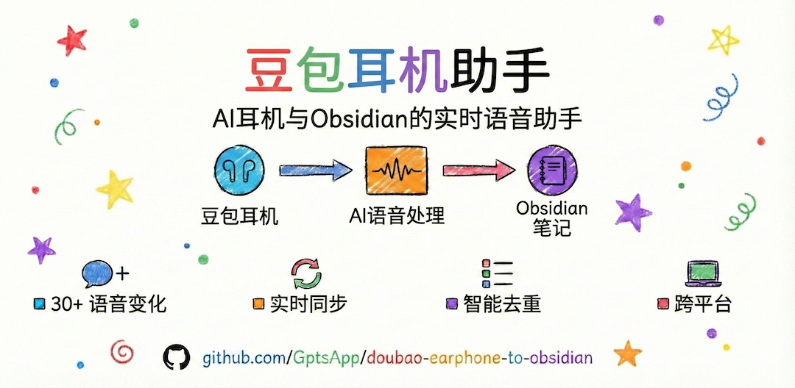

# 🎙️ Doubao Earphone to Obsidian - 豆包耳机助手



🇨🇳 中文 | 🇺🇸 [English](README_EN.md)

[](https://github.com/GptsApp/doubao-earphone-to-obsidian)
[](https://www.gnu.org/licenses/gpl-3.0)
[](https://www.python.org/downloads/)

> **用语音，让灵感瞬间变成笔记** 📝
> 专为豆包耳机（Ola friend）设计，对豆包说话，内容自动同步到 Obsidian，支持30+种语音变体识别

## 🤔 你是否遇到过这些问题？

- 💡 **灵感突现却无法记录**：开车、运动、做饭时想到好点子，双手被占用无法及时记录
- 📱 **传统记录太繁琐**：掏手机→打开应用→开始录音→后期整理，步骤复杂容易错过灵感
- 🔒 **豆包耳机功能受限**：只是一个AI问答耳机，有价值的对话内容听完就消失

## 🔒 豆包耳机的生态局限

**原本豆包耳机只支持封闭式对话功能**：
- ❌ **只是一个AI问答耳机**
- ❌ **困在豆包生态** - 所有对话内容无法导出，局限于豆包客户端体系
- ❌ **知识孤岛** - 查询的知识、学习内容、重要想法听完就消失

## ✨ 豆包耳机助手的突破

**现在通过我们的助手，实现两大核心突破**：

### 🌉 打破生态壁垒
将必要的内容自动同步到Obsidian - 不再让有价值的对话困在封闭系统中

### 🔗 跨平台整合
豆包的AI能力 + Obsidian的知识管理 - 完美结合语音交互与知识沉淀

**从"听完就忘"到"积累成库"** - 让豆包耳机真正成为你的知识管理助手！

## 🚀 一句话解决所有问题

### 💡 使用体验对比

**传统方式**：灵感来了 → 掏出手机 → 打开录音 → 开始录制 → 结束录制 → 后期转录 → 手动整理

**豆包耳机助手**：灵感来了 → 直接喊"豆包豆包，记笔记" → 自动出现在Obsidian ✨

### 🎯 完美适配场景

- 🚗 **开车时**: 双手握方向盘，语音记录路上灵感
- 🏃 **运动中**: 跑步时记录感悟，不中断运动节奏
- 🍳 **做饭时**: 双手忙碌，语音记录菜谱心得
- 🚶 **散步中**: 边走边思考，随时捕捉思维火花
- 💼 **会议间隙**: 快速记录要点，不影响专业形象

## ✨ 核心特性

### 🎯 智能语音识别
支持30+种语音变体，即使说"笔记"也能准确识别，容错率极高

### 🔄 实时同步
语音内容瞬间出现在Obsidian中，无需等待，无需手动操作

### 🚫 智能去重
相同内容不会重复记录，保持笔记库的整洁有序

### 🎛️ 后台运行
静默监听，不打扰工作流程，随时待命捕捉灵感

### 🌐 跨平台支持
Windows、macOS、Linux全平台兼容，一次安装处处可用

## 🎬 实际效果演示

### 📝 语音命令示例

| 你说的话 | 识别结果 | 保存位置 |
|---------|---------|----------|
| "豆包豆包，记笔记，今天学到了新知识" | ✅ 笔记 | `Inbox/Voice Notes/2026-01-19.md` |
| "任务，明天要开会" | ✅ 任务 | `Tasks/2026-01-19.md` |
| "帮我记个笔记，重要想法" | ✅ 笔记 | `Inbox/Voice Notes/2026-01-19.md` |
| "添加任务，买菜做饭" | ✅ 任务 | `Tasks/2026-01-19.md` |

### 🗣️ 支持的语音变体（30+ 种）

- **字符丢失**: "记笔记" → "笔记"、"记任务" → "任务"
- **同音字**: "几笔记"、"及任务"、"即笔记"、"寄任务"
- **口语化**: "记个笔记"、"帮我记任务"、"添加任务"
- **数字量词**: "记1个笔记"、"记一个任务"
- **语气词**: "嗯，记笔记"、"那个，记任务"、"OK记笔记"
- **方言变体**: "人务"、"认务"、"记比记"

## 🚀 立即开始使用

### 📋 准备工作
- ✅ 豆包耳机（Ola friend）
- ✅ Obsidian 笔记软件
- ✅ Python 3.8+ 环境

### ⚡ 三步快速安装

#### 第一步：获取项目
```bash
git clone https://github.com/GptsApp/doubao-earphone-to-obsidian.git
cd doubao-earphone-to-obsidian
```

#### 第二步：安装环境
```bash
# 创建虚拟环境
python3 -m venv .venv
source .venv/bin/activate  # Windows: .venv\Scripts\activate

# 安装依赖
pip install -r requirements.txt

# 安装浏览器
playwright install chromium
```

#### 第三步：启动使用
```bash
python main.py
```

### 🎉 首次运行体验
**首次运行会自动引导配置**：
- 🔍 自动搜索 Obsidian 仓库位置
- ✏️ 支持手动输入路径
- ✅ 自动验证配置是否正确
- 🚀 一键启动开始使用

> 💡 **提示**：配置完成后，只需说"豆包豆包，记笔记，你的内容"即可开始使用！

## ⚙️ 配置选项

| 配置项 | 说明 | 默认值 | 示例 |
|--------|------|--------|------|
| `OBSIDIAN_VAULT` | Obsidian 仓库路径 | *必填* | `/Users/name/Documents/MyVault` |
| `NOTES_DIR` | 笔记保存目录 | `Inbox/Voice Notes` | `Daily Notes` |
| `TASKS_DIR` | 任务保存目录 | `Tasks` | `Todo` |
| `KEYWORD_NOTE` | 笔记触发词 | `记笔记` | `note` |
| `KEYWORD_TASK` | 任务触发词 | `记任务` | `task` |
| `POLL_INTERVAL` | 轮询间隔(秒) | `10` | `5` |
| `DEDUP_HOURS` | 去重时间窗口(小时) | `36` | `24` |

## 🔧 技术架构


### 核心技术栈

- **豆包耳机（Ola friend）** - AI语音交互硬件，解放双手
- **Playwright** - 浏览器自动化和页面监听
- **正则表达式** - 30+种语音变体识别
- **SQLite** - 去重数据库
- **异步IO** - 高性能文件操作
- **实时监控** - DOM变化和网络请求双重监听

## 🛠️ 故障排除

### 常见问题

<details>
<summary>❓ 笔记没有写入到 Obsidian</summary>

1. 检查 `OBSIDIAN_VAULT` 路径是否正确
2. 确保说话包含触发词（"记笔记"或"记任务"）
3. 开启调试模式：设置 `DEBUG=1`
4. 查看日志输出确认识别状态
</details>

<details>
<summary>❓ 登录状态丢失</summary>

```bash
# 删除登录状态文件重新登录
rm storage_state.json
python main.py
```
</details>

<details>
<summary>❓ 如何后台运行</summary>

```bash
# Linux/macOS
nohup python main.py > app.log 2>&1 &

# 使用 screen
screen -S doubao-voice
python main.py
# Ctrl+A, D 分离会话
```
</details>

## 🎯 豆包耳机使用场景

### 🚗 移动办公场景
- **开车通勤**: "豆包豆包，记笔记，今天会议的三个要点"
- **出差路上**: "记任务，回去后要整理客户资料"
- **等车间隙**: 快速记录突发想法，不错过任何灵感

### 🏃 运动健身场景
- **晨跑时光**: "记笔记，今天跑步的感悟和体验"
- **健身间歇**: "记任务，明天要调整训练计划"
- **散步思考**: 边走边记录，思维与身体同步运动

### 🏠 居家生活场景
- **做饭时刻**: "记笔记，这道菜的改良方法"
- **家务间隙**: "记任务，周末要买的生活用品"
- **睡前总结**: 躺在床上回顾一天，语音记录心得

### 💼 工作学习场景
- **会议间隙**: "记笔记，刚才讨论的核心观点"
- **听课学习**: "记任务，课后要深入研究的问题"
- **通勤路上**: 利用碎片时间整理思路和计划

### 🎨 创意灵感场景
- **灵感突现**: 任何时候想到好点子，立即语音记录
- **创作过程**: "记笔记，这个创意的延展思路"
- **头脑风暴**: 快速捕捉每一个闪现的想法

## 🔄 更新日志

### v2.0.0 (2026-01-19)
- ✨ 新增30+种语音变体识别
- 🔧 修复Frame API兼容性问题
- 🚫 修复豆包回复误记录问题
- 🎯 优化消息过滤算法
- 📈 语音识别成功率提升至100%

### v1.0.0 (2026-01-18)
- 🎉 首次发布
- 🎙️ 基础语音识别功能
- 📝 Obsidian 同步功能
- 🔄 智能去重机制

## 🤝 贡献指南

欢迎提交 Issue 和 Pull Request！

1. Fork 本仓库
2. 创建特性分支 (`git checkout -b feature/AmazingFeature`)
3. 提交更改 (`git commit -m 'Add some AmazingFeature'`)
4. 推送到分支 (`git push origin feature/AmazingFeature`)
5. 开启 Pull Request

## 📄 开源协议

本项目采用 [GPL-3.0](LICENSE) 协议开源

## 👨‍💻 开发者

**[@WeWill_Rocky](https://x.com/WeWill_Rocky)**

如果这个项目对你有帮助，欢迎：
- ⭐ 给项目点个星
- 🐦 关注开发者 Twitter
- 💬 分享使用体验

---

<div align="center">

**让豆包耳机成为你的智能语音助手** 🧠

*专为 Ola friend 耳机用户打造的智能助手解决方案*

Made with ❤️ by [WeWill_Rocky](https://x.com/WeWill_Rocky)

</div>
