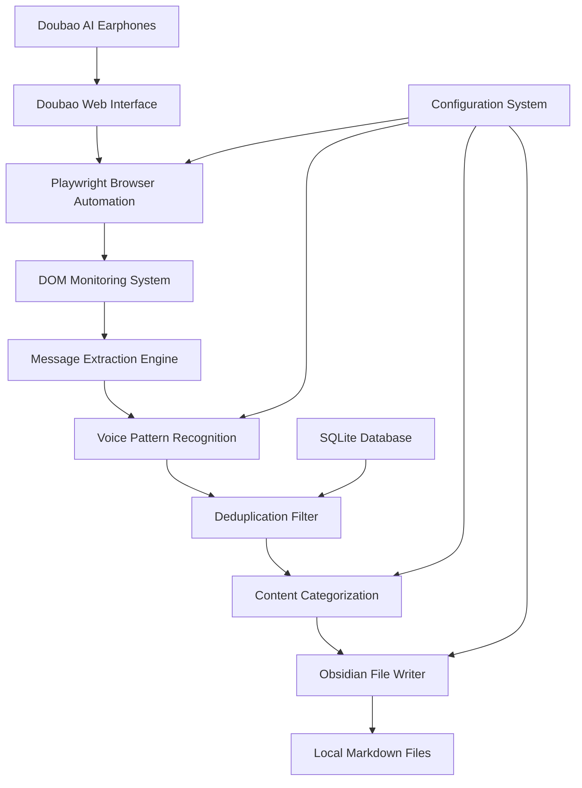

# Technical Architecture - Doubao Earphone to Obsidian

## 🏗️ System Overview

Doubao Earphone to Obsidian is a real-time voice-to-text bridge that monitors Doubao AI conversations and automatically syncs recognized content to Obsidian. The system uses browser automation, intelligent text processing, and file system integration to create a seamless voice note-taking experience.

## 🔧 Core Architecture



## 🧩 Component Details

### 1. Browser Automation Layer

**Technology**: Playwright (Chromium)
**Purpose**: Automated interaction with Doubao web interface

```python
class VoiceMonitor:
    async def setup_browser(self) -> tuple[Browser, BrowserContext, Page]:
        """Initialize browser with persistent session"""
        browser = await self.playwright.chromium.launch(
            headless=False,
            args=['--no-sandbox', '--disable-dev-shm-usage']
        )

        # Load persistent session state
        context = await browser.new_context(
            storage_state="storage_state.json" if Path("storage_state.json").exists() else None
        )

        page = await context.new_page()
        return browser, context, page
```

**Key Features**:
- Persistent login state management
- Headless operation support
- Cross-platform compatibility
- Automatic session recovery

### 2. DOM Monitoring System

**Technology**: Playwright Page Evaluation + MutationObserver
**Purpose**: Real-time detection of new messages in chat interface

```python
async def monitor_messages(self, page: Page) -> None:
    """Monitor DOM changes for new messages"""
    await page.evaluate("""
        const observer = new MutationObserver((mutations) => {
            mutations.forEach((mutation) => {
                if (mutation.type === 'childList') {
                    mutation.addedNodes.forEach((node) => {
                        if (node.nodeType === Node.ELEMENT_NODE) {
                            // Check for new message elements
                            const messages = node.querySelectorAll('[data-message-id]');
                            messages.forEach(msg => window.newMessages.push(msg));
                        }
                    });
                }
            });
        });

        observer.observe(document.body, {
            childList: true,
            subtree: true
        });
    """)
```

**Monitoring Strategy**:
- **Primary**: MutationObserver for real-time DOM changes
- **Fallback**: Periodic polling every 5-10 seconds
- **Smart Polling**: Adaptive intervals based on activity

### 3. Message Extraction Engine

**Technology**: CSS Selectors + Text Processing
**Purpose**: Extract and clean message content from DOM elements

```python
async def extract_messages(self, page: Page) -> list[dict]:
    """Extract messages from page DOM"""
    messages = await page.evaluate("""
        () => {
            const messageElements = document.querySelectorAll('.message-content');
            return Array.from(messageElements).map(el => ({
                text: el.textContent.trim(),
                timestamp: el.getAttribute('data-timestamp'),
                sender: el.getAttribute('data-sender'),
                messageId: el.getAttribute('data-message-id')
            }));
        }
    """)

    return [msg for msg in messages if self._is_user_message(msg)]
```

**Extraction Logic**:
- Target user messages only (filter out AI responses)
- Extract metadata (timestamp, sender, message ID)
- Clean and normalize text content
- Handle edge cases (empty messages, system notifications)

### 4. Voice Pattern Recognition

**Technology**: Regular Expressions + Fuzzy Matching
**Purpose**: Identify voice commands and categorize content

```python
class VoicePatternMatcher:
    def __init__(self):
        # 30+ variations of voice commands
        self.note_patterns = [
            r'记笔记',
            r'笔记',
            r'几笔记',
            r'及笔记',
            r'即笔记',
            r'记个笔记',
            r'帮我记笔记',
            r'记\d*个?笔记',
            # ... more patterns
        ]

        self.task_patterns = [
            r'记任务',
            r'任务',
            r'人务',
            r'认务',
            r'记个任务',
            r'添加任务',
            # ... more patterns
        ]

    def classify_message(self, text: str) -> tuple[str, str]:
        """Classify message type and extract content"""
        for pattern in self.note_patterns:
            if re.search(pattern, text, re.IGNORECASE):
                content = re.sub(pattern, '', text, flags=re.IGNORECASE).strip()
                return 'note', content

        for pattern in self.task_patterns:
            if re.search(pattern, text, re.IGNORECASE):
                content = re.sub(pattern, '', text, flags=re.IGNORECASE).strip()
                return 'task', content

        return 'unknown', text
```

**Pattern Matching Features**:
- **Fuzzy Recognition**: Handles speech-to-text errors
- **Context Awareness**: Considers surrounding words
- **Multilingual Support**: Extensible for other languages
- **Performance Optimized**: Compiled regex patterns

### 5. Deduplication System

**Technology**: SQLite + Content Hashing
**Purpose**: Prevent duplicate entries and manage message history

```python
class DeduplicationDB:
    def __init__(self, db_path: str = "voice_notes.db"):
        self.db_path = db_path
        self._init_db()

    def _init_db(self):
        """Initialize SQLite database"""
        with sqlite3.connect(self.db_path) as conn:
            conn.execute("""
                CREATE TABLE IF NOT EXISTS processed_messages (
                    id INTEGER PRIMARY KEY AUTOINCREMENT,
                    content_hash TEXT UNIQUE NOT NULL,
                    original_text TEXT NOT NULL,
                    message_type TEXT NOT NULL,
                    processed_at TIMESTAMP DEFAULT CURRENT_TIMESTAMP,
                    file_path TEXT
                )
            """)

    def is_duplicate(self, content: str, hours: int = 36) -> bool:
        """Check if content was processed recently"""
        content_hash = hashlib.md5(content.encode()).hexdigest()

        with sqlite3.connect(self.db_path) as conn:
            cursor = conn.execute("""
                SELECT COUNT(*) FROM processed_messages
                WHERE content_hash = ?
                AND processed_at > datetime('now', '-{} hours')
            """.format(hours), (content_hash,))

            return cursor.fetchone()[0] > 0
```

**Deduplication Strategy**:
- **Content Hashing**: MD5 hash of normalized content
- **Time Window**: Configurable deduplication period (default: 36 hours)
- **Exact Match**: Prevents identical content duplication
- **Cleanup**: Automatic old record removal

### 6. File System Integration

**Technology**: Async File I/O + Pathlib
**Purpose**: Write organized markdown files to Obsidian vault

```python
class ObsidianWriter:
    async def write_note(self, content: str, note_type: str) -> str:
        """Write note to appropriate Obsidian directory"""
        timestamp = datetime.now()
        date_str = timestamp.strftime("%Y-%m-%d")
        time_str = timestamp.strftime("%H:%M:%S")

        # Determine target directory
        if note_type == 'note':
            dir_path = Path(self.vault_path) / self.notes_dir
        else:  # task
            dir_path = Path(self.vault_path) / self.tasks_dir

        dir_path.mkdir(parents=True, exist_ok=True)

        # Create daily file
        file_path = dir_path / f"{date_str}.md"

        # Format content
        formatted_content = f"\n## {time_str}\n\n{content}\n"

        # Append to file
        async with aiofiles.open(file_path, 'a', encoding='utf-8') as f:
            await f.write(formatted_content)

        return str(file_path)
```

**File Organization**:
- **Daily Files**: One file per day (YYYY-MM-DD.md)
- **Directory Structure**: Separate folders for notes and tasks
- **Timestamp Headers**: Each entry timestamped
- **Atomic Writes**: Prevent file corruption

## 🔄 Data Flow

### 1. Voice Input Processing
```
User speaks → Doubao AI → Web Interface → DOM Update → Playwright Detection
```

### 2. Content Processing Pipeline
```
Raw Message → Pattern Matching → Content Extraction → Deduplication Check → File Writing
```

### 3. Error Handling Flow
```
Error Detected → Log Error → Retry Logic → Fallback Strategy → User Notification
```

## ⚡ Performance Optimizations

### 1. Intelligent Polling
- **Active Mode**: 5-second intervals when recent activity detected
- **Idle Mode**: 10-second intervals during quiet periods
- **Adaptive**: Automatically adjusts based on message frequency

### 2. Memory Management
- **Message Buffer**: Limited to last 100 messages
- **Database Cleanup**: Automatic removal of old records
- **Browser Resources**: Proper cleanup on shutdown

### 3. Async Operations
- **Non-blocking I/O**: All file operations are asynchronous
- **Concurrent Processing**: Multiple messages processed in parallel
- **Resource Pooling**: Efficient browser context management

## 🛡️ Security Considerations

### 1. Data Privacy
- **Local Processing**: All data processed locally
- **No Cloud Storage**: Messages never sent to external servers
- **Encrypted Storage**: SQLite database with optional encryption

### 2. Browser Security
- **Sandboxed Environment**: Playwright runs in isolated context
- **Session Management**: Secure storage of authentication tokens
- **Permission Model**: Minimal required permissions

### 3. File System Security
- **Path Validation**: Prevent directory traversal attacks
- **Permission Checks**: Verify write permissions before operations
- **Atomic Operations**: Prevent partial file writes

## 🔧 Configuration System

### Environment Variables
```bash
OBSIDIAN_VAULT=/path/to/vault          # Required: Obsidian vault path
NOTES_DIR=Inbox/Voice Notes            # Optional: Notes directory
TASKS_DIR=Tasks                        # Optional: Tasks directory
POLL_INTERVAL=10                       # Optional: Polling interval (seconds)
DEDUP_HOURS=36                         # Optional: Deduplication window (hours)
DEBUG=1                                # Optional: Enable debug logging
```

### Runtime Configuration
```python
class Settings(BaseSettings):
    OBSIDIAN_VAULT: str = ""
    NOTES_DIR: str = "Inbox/Voice Notes"
    TASKS_DIR: str = "Tasks"
    POLL_INTERVAL: int = Field(10, ge=1, le=300)
    SMART_POLLING: bool = True
    DEDUP_HOURS: int = Field(36, ge=1, le=168)

    @field_validator('OBSIDIAN_VAULT')
    def validate_vault_path(cls, v):
        if not v:
            raise ValueError("OBSIDIAN_VAULT is required")
        path = Path(v)
        if not path.exists():
            raise ValueError(f"Vault path does not exist: {v}")
        return str(path.absolute())
```

## 🚀 Deployment Strategies

### 1. Development Mode
```bash
python main.py  # Interactive mode with GUI
```

### 2. Production Mode
```bash
nohup python main.py > app.log 2>&1 &  # Background daemon
```

### 3. Service Mode
```bash
# systemd service (Linux)
sudo systemctl enable doubao-voice-notes
sudo systemctl start doubao-voice-notes
```

## 📊 Monitoring and Logging

### Log Levels
- **DEBUG**: Detailed execution information
- **INFO**: General operational messages
- **WARNING**: Potential issues that don't stop execution
- **ERROR**: Errors that require attention

### Metrics Tracking
- Message processing rate
- Deduplication hit rate
- File write success rate
- Browser session stability

## 🔮 Future Enhancements

### 1. Multi-Platform Support
- **Telegram Integration**: Monitor Telegram voice messages
- **WhatsApp Support**: Extract voice notes from WhatsApp Web
- **Discord Bot**: Real-time voice note processing

### 2. Advanced AI Features
- **Content Summarization**: AI-powered note summarization
- **Smart Categorization**: Automatic tag and category assignment
- **Sentiment Analysis**: Mood tracking in voice notes

### 3. Performance Improvements
- **WebSocket Monitoring**: Real-time message streaming
- **Incremental Sync**: Only process new content
- **Caching Layer**: Intelligent content caching

This technical architecture provides a robust foundation for voice-to-text processing while maintaining simplicity and reliability. The modular design allows for easy extension and customization based on user needs.